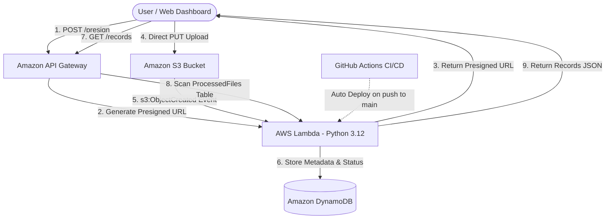

# ⚡ Event-Driven Serverless Pipeline & File Dashboard

A cloud-native, event-driven data processing pipeline and real-time monitoring dashboard built on **AWS**. This project enables secure client-side file uploads directly to **Amazon S3** using presigned URLs, processes uploaded objects instantly with **AWS Lambda**, indexes metadata in **Amazon DynamoDB**, and features automated CI/CD deployment via **GitHub Actions**.

---

## 🏗️ System Architecture



### ASCII Architecture Diagram

```text
 ┌─────────────────┐
 │   Web Browser   │◄──────────────────────────────────────────────────┐
 │  (Dashboard UI) │                                                   │
 └──────┬───▲──────┘                                                   │
        │   │ (3. Return Presigned URL)                                │ (9. Return Items JSON)
        │   │                                                          │
 (1. POST /presign) & (7. GET /records)                                │
        │   │                                                          │
        ▼   │                                                          │
 ┌──────────┴──────┐      (2 & 8. Route Request)    ┌──────────────────┴──────────┐
 │  Amazon API     ├─────────────────────────────►│        AWS Lambda           │
 │    Gateway      │                              │    (s3FileProcessor)        │
 └─────────────────┘                              └──────────────┬──────────────┘
        │                                                        │
        │ (4. Direct File PUT Upload)                            │ (6. Store Record)
        ▼                                                        ▼
 ┌─────────────────┐    (5. s3:ObjectCreated Event) ┌───────────────────────────┐
 │   Amazon S3     ├───────────────────────────────►│      Amazon DynamoDB       │
 │    Bucket       │                                │    (ProcessedFiles Table) │
 └─────────────────┘                                └───────────────────────────┘
```

---

## ✨ Key Features

- **🔒 Direct S3 Uploads via Presigned URLs**: Secure client-side uploads directly to S3 without exposing AWS credentials or burdening server memory.
- **⚡ Event-Driven Automation**: S3 `s3:ObjectCreated` notification triggers AWS Lambda instantly upon file arrival with zero idle compute costs.
- **📊 Real-time Dashboard**: Responsive web interface to upload files, monitor real-time processing status, and view metrics.
- **🗄️ DynamoDB Metadata Indexing**: Automatically extracts and persists file attributes (name, size, bucket, file extension, timestamp, processing status, UUID).
- **🚀 CI/CD Automation**: GitHub Actions workflow automatically packages and deploys Lambda updates on code push.

---

## 🔄 End-to-End Workflow

1. **Presigned URL Request**: The frontend dashboard sends a request to API Gateway (`POST /presign`).
2. **URL Generation**: AWS Lambda calculates a short-lived S3 Presigned URL using `boto3`.
3. **Direct S3 Upload**: The browser uploads the file directly to the S3 bucket (`serverless-pipeline-uploads`).
4. **S3 Event Trigger**: S3 automatically invokes the `s3FileProcessor` Lambda function via `s3:ObjectCreated` notification.
5. **Data Indexing**: Lambda parses file metadata and writes a new item into the DynamoDB `ProcessedFiles` table.
6. **Live Monitoring**: The frontend periodically fetches updated records (`GET /records`) via API Gateway to display active file status.

---

## 🛠️ Tech Stack

- **Cloud Platform**: AWS (Amazon Web Services)
- **Compute**: AWS Lambda (Python 3.12, Boto3)
- **Storage**: Amazon S3 (Simple Storage Service)
- **Database**: Amazon DynamoDB (`ProcessedFiles` table)
- **API Management**: Amazon API Gateway (HTTP / REST API)
- **Frontend**: HTML5, Modern CSS3, JavaScript (Fetch API)
- **CI/CD Pipeline**: GitHub Actions (`deploy.yml`)

---

## 📂 Repository Structure

```text
Serverless-pipeline/
├── .github/
│   └── workflows/
│       └── deploy.yml            # CI/CD automated Lambda deployment
├── dashboard/
│   └── index.html                # Web dashboard frontend UI
├── lambda/
│   └── lambda_function.py        # AWS Lambda handler logic
├── apigw-mock-template.json      # API Gateway request/response mapping template
├── s3-cors.json                  # S3 bucket CORS configuration
├── .gitignore                    # Excluded files & build artifacts
└── README.md                     # Project documentation & architecture
```

---

## 🌐 API Endpoints Reference

| Method | Endpoint | Description |
| :--- | :--- | :--- |
| `POST` | `/presign` | Generates a short-lived S3 presigned URL for direct file upload |
| `GET` | `/records` | Fetches all processed file records from DynamoDB |
| `POST` | `/process` | Manually triggers test pipeline processing |
| `OPTIONS` | `/*` | Handles CORS preflight headers |

---

## 🚀 Deployment & Setup

### 1. AWS Resources Setup
1. **S3 Bucket**: Create bucket `serverless-pipeline-uploads` and apply CORS rules from [`s3-cors.json`](s3-cors.json).
2. **DynamoDB Table**: Create table `ProcessedFiles` with partition key `fileId` (String).
3. **AWS Lambda**: Create Python 3.12 function `s3FileProcessor` with IAM permissions for S3 read & DynamoDB `PutItem`/`Scan`.
4. **API Gateway**: Create HTTP API with routes `/presign`, `/records`, and `/process`, pointing to `s3FileProcessor`.

### 2. CI/CD Credentials
Add the following secrets to your GitHub Repository (**Settings > Secrets and variables > Actions**):
- `AWS_ACCESS_KEY_ID`
- `AWS_SECRET_ACCESS_KEY`
- `AWS_REGION` (e.g., `us-east-1` or `ap-south-1`)

Pushing changes to `lambda/**` on `main` branch will automatically trigger deployment.
